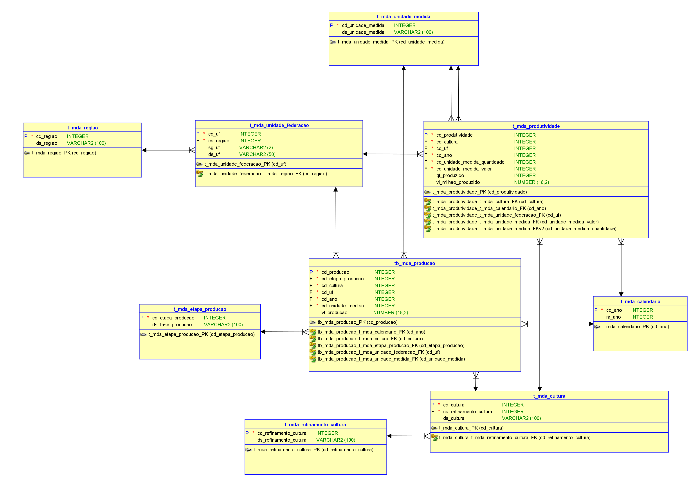
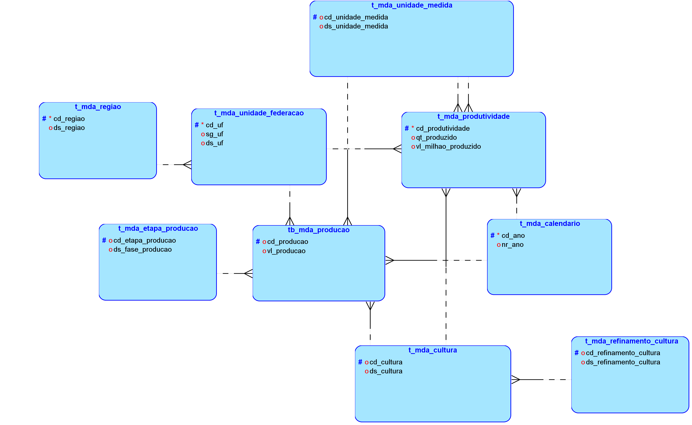

# FIAP - Faculdade de Informática e Administração Paulista

 

## 📜 Nome do Projeto

# Modelo de Dados para Análise da Produção Agrícola no Brasil

## GRUPO 53

## 👨‍🎓 Integrantes: 
- <a href="https://www.linkedin.com/in/a1exlima/">RM559784@fiap.com.br - Alex da Silva Lima </a>
- <a href="https://www.linkedin.com/in/johnatanloriano/">RM559546@fiap.com.br - Johnatan Sousa Macedo Loriano</a>
- <a href="https://www.linkedin.com/in/matheus-maia-655bb1250/">RM560683@fiap.com.br - Matheus Augusto Rodrigues Maia</a>
- <a href="https://www.linkedin.com/in/brunoconter/">RM560518@fiap.com.br - Bruno Henrique Nielsen Conter</a>
- <a href="https://www.linkedin.com/in/fabiosantoscardoso/">RM560479@fiap.com.br - Fabio Santos Cardoso</a>

## 👩‍🏫 Professores:
### Tutor(a) 
- <a href="https://www.linkedin.com/in/lucas-gomes-moreira-15a8452a/">Lucas Gomes Moreira</a>
### Coordenador(a)
- <a href="https://www.linkedin.com/in/profandregodoi/">André Godoi</a>

### Objetivo
Este modelo de dados fornece uma base para realizar consultas analíticas e gerar insights sobre a produção agrícola por região e cultura no Brasil. Ele visa apoiar estudos econômicos, planejamentos estratégicos e a tomada de decisões no setor agroindustrial.

### Descrição
Este projeto implementa um modelo de dados relacional voltado para a consulta e análise de dados públicos sobre a produção agrícola no Brasil, com recorte nas principais culturas de cereais, leguminosas, oleaginosas, cana-de-açúcar e café. A proposta é estruturar dados históricos dos últimos cinco anos em um formato que permita análises segmentadas por Unidade Federativa (UF), oferecendo suporte à tomada de decisão e estudos econômicos no setor agrícola.

### Estrutura dos Dados
Os dados foram obtidos do sistema SIDRA do IBGE e estão distribuídos em duas categorias principais:
1. **Culturas Temporárias (Tabela 1612)**: Dados de área plantada, área colhida, quantidade produzida, rendimento médio e valor de produção.
2. **Culturas Permanentes (Tabela 1613)**: Informações sobre área destinada à colheita, área colhida, quantidade produzida e valor da produção.

As principais culturas selecionadas para análise incluem amendoim, arroz, café, milho, soja, entre outras relevantes para o setor agrícola.

### Entidades e Relacionamentos
Foram desenvolvidas diversas entidades para assegurar a integridade dos dados e possibilitar uma análise estruturada. As principais entidades incluem:
- **tb_mda_producao**: Armazena os indicadores de plantio e colheita por cultura e UF.
- **t_mda_produtividade**: Armazena dados sobre produtividade e valor de produção.
- **t_mda_calendario**: Contém o valor de "ano", repetido nas tabelas de culturas temporárias e permanentes.
- **t_mda_cultura** e **t_mda_refinamento_cultura**: Organizam os valores relacionados às culturas e refinamentos específicos de cada produto agrícola.
- **t_mda_regiao** e **t_mda_unidade_federacao**: Estruturam os dados por região e UF, permitindo análises geográficas.
- **t_mda_unidade_medida**: Isola as diferentes unidades de medida, garantindo que novos indicadores possam ser adicionados sem comprometer o modelo atual.

### Fontes de Dados
O modelo foi estruturado com dados provenientes de duas fontes principais:
- **IBGE SIDRA**:
  - **Tabela 1612**: Produção Agrícola Municipal para culturas temporárias.
  - **Tabela 1613**: Produção Agrícola Municipal para culturas permanentes.
- **IBGE Áreas Territoriais**:
  - Divisões territoriais do Brasil, por grandes regiões e unidades da federação.

### Considerações Técnicas
- Os dados foram extraídos em arquivos XLSX, sendo cada arquivo estruturado em uma tabela com colunas organizadas para consultas eficientes.
- Abas de dados que não alimentam diretamente o modelo foram desconsideradas.
- A entidade **t_mda_unidade_medida** foi desenvolvida para garantir flexibilidade na entrada de novos indicadores com diferentes unidades de medida.

### Estrutura do Repositório
O repositório está organizado para facilitar o uso e manutenção:
- **Scripts de Criação e População do Banco de Dados**: Scripts SQL que criam e populam as tabelas com os dados brutos.
- **Diagrama do Modelo ER**: Diagrama relacional que representa as entidades e seus relacionamentos.
- **Documentação**: Explicações detalhadas sobre a estrutura de dados, o processo de modelagem e exemplos de consultas SQL.

## Modelos Físicos e Lógicos

Modelo Físico

</a>

Modelo Lógico

</a>

## 📁 Estrutura de pastas

- <b>assets</b>: aqui estão os arquivos relacionados a elementos não-estruturados deste repositório, como imagens.

- <b>Dados</b>: Base de dados do Sidra do IBGE.

- <b>Dicionario</b>: Dicionário com os principais termos adotados neste modelo.

- <b>Modelo</b>: Posicione aqui scripts auxiliares para tarefas específicas do seu projeto. Exemplo: deploy, migrações de banco de dados, backups.

- <b>SQL</b>: Arquivos DMD e DDL de configuração de banco de dados.

- <b>README.md</b>: arquivo que serve como guia e explicação geral sobre o projeto (o mesmo que você está lendo agora).

## Arquivos Importantes

- **Documentação do MER**: Detalhar a criação do modelo de dados para relacionamento e consulta de dados
públicos de plantios por UF no brasil.

  - [DOCUMENTACAO_MER.pdf](DOCUMENTACAO_MER.pdf)
  
- **Modelo MER**: Arquivo de configuração extraído do Oracle SQL Developer
  - [modelo_agro.dmd](Modelo/modelo_agro.dmd)
  
- **Modelo DDL**: Comandos para criar as tabelas
  - [DDL.sql](SQL/DDL.sql)
  
- **Modelo DML**: Comandos para realizar queries nos dados
  - [DML.sql](SQL/DML.sql)

## 📋 Licença

<a property="dct:title" rel="cc:attributionURL" href="https://github.com/agodoi/template">MODELO GIT FIAP</a> por <a rel="cc:attributionURL dct:creator" property="cc:attributionName" href="https://fiap.com.br">Fiap</a> está licenciado sobre <a href="http://creativecommons.org/licenses/by/4.0/?ref=chooser-v1" target="_blank" rel="license noopener noreferrer" style="display:inline-block;">Attribution 4.0 International</a>.

